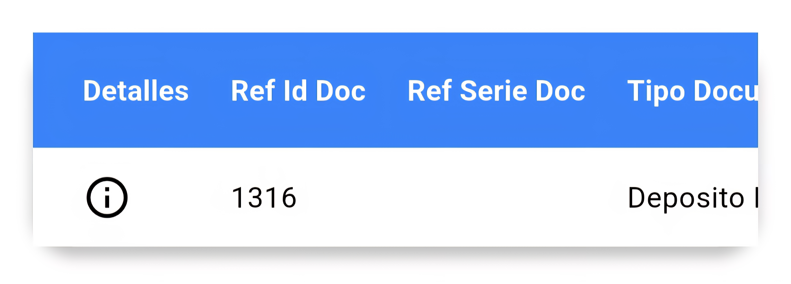

# doc-vista-estructura-json
Una herramienta de visualización flexible para estructuras JSON en aplicaciones Flutter. Convierte datos JSON complejos en tablas interactivas con vistas alternativas, facilitando la depuración y análisis de datos.

---

### Documentación de Funcionalidad
### Visualización de Estructuras JSON como Tablas
Con el fin de facilitar la lectura y análisis de los datos enviados al sistema en formato JSON, se implementó una funcionalidad que transforma las estructuras en tablas dinámicas.

### Objetivo
- Visualizar de manera clara los datos contenidos en el campo estructura generado al crear un registro utilizando PaTblDocumentoCEstructura.  
- Permitir identificar inconvenientes o registros incompletos.  
- Incluir una columna Detalles que abre un diálogo emergente mostrando la estructura completa del JSON.  

### Estructura de Datos
La funcionalidad procesa datos con la siguiente estructura JSON:
```json
[
  {
    "consecutivo_Interno": 502,
    "estructura": [
      {
        "RefIdDoc": "1316",
        "TipoDocumento": 49,
        "DesTipoDocumento": "Deposito Bancario",
        "Banco": 2,
        "NombreBanco": "BANCO INDUSTRIAL",
        "CuentaBancaria": 1,
        "DesCuentaBancaria": "BI (074-000199-0)",
        "Monto": 12,
        "FacturaNit": "C/F",
        "FacturaNombre": "SAMUEL BARRERA",
        "FechaDocumento": "2025-08-29T00:00:00.000",
        "UserName": "ds",
        "ConsecutivoInterno": 7645102
      }
    ],
    "userName": "ds",
    "fecha_Hora": "2025-08-29T10:59:04.347",
    "tipo_Estructura": 1,
    "estado": 11,
    "id_Unc": "7162d83f-7365-42eb-bb3e-a737109797ad"
  }
]
```
## Componente de Visualización
### Widget Principal

El componente principal es un widget Flutter que renderiza la estructura JSON como una tabla interactiva:
```dart
// Material es el contenedor principal que añade elevación y bordes redondeados
Material(
  elevation: 5, // Sombras del contenedor
  borderRadius: BorderRadius.circular(20), // Bordes redondeados
  child: Container(
    // Decoración interna del contenedor
    decoration: BoxDecoration(
      color: Colors.white, // Color de fondo del contenedor
      borderRadius: BorderRadius.circular(20), // Bordes redondeados
    ),
    width: double.infinity, // Ocupa todo el ancho disponible
    child: SingleChildScrollView(
      scrollDirection: Axis.horizontal, // Permite scroll horizontal
      child: SingleChildScrollView(
        scrollDirection: Axis.vertical, // Permite scroll vertical
        child: DataTable(
          // Configuración de columnas y filas
          columns: [
            // Columna para el botón de detalles
            DataColumn(label: Text('Detalles')),
            // Otras columnas
          ],
          rows: [
            // Ejemplo de fila con botón para mostrar diálogo
            DataRow(
              cells: [
                DataCell(
                  IconButton(
                    icon: Icon(Icons.info_outline), // Ícono de información
                    tooltip: 'Ver Detalles JSON', // Texto al dejar presionado
                    onPressed: () {
                      // Tomo el JSON de la estructura de este registro específico
                      // 'docEstructura[rowIndex].estructura' accede al campo 'estructura'
                      // del registro seleccionado en la lista 'docEstructura'
                      String estructuraJSON = depositoNotifier.docEstructura[rowIndex].estructura;
                      
                      // Llamo al diálogo para mostrar la estructura JSON
                      mostrarDialogoEstructura(
                        context: context, // Contexto actual para mostrar el diálogo
                        estructuraJSON: estructuraJSON, // JSON del registro como String
                        temaClaro: themeNotifier.temaClaro, // Tema claro/oscuro
                      );
                    },
                  ),
                ),
                // Aquí irían las demás celdas con datos dinámicos del registro
              ],
            ),
          ],
        ),
      ),
    ),
  ),
)
```
### Tabla principal ejemplo:


## Diálogo de Visualización
La función mostrarDialogoEstructura muestra un diálogo con dos vistas alternativas:

#### Vista de Tabla
Muestra los datos en formato tabular, similar al componente principal pero con todos los campos visibles.

#### Vista JSON
Muestra el JSON completo con sintaxis coloreada para mejor legibilidad.

### Dependencia necesaria para diseño del json:
```yaml
flutter_highlight: ^0.7.0
```

### Implementación del Diálogo

```dart
Future<void> mostrarDialogoEstructura({
  required BuildContext context, // Contexto donde se mostrará el diálogo
  required String estructuraJSON, // JSON en String que se mostrará
  required bool temaClaro, // Indica si el tema de la app es claro
}) async {
  String _vistaSeleccionada = 'Tabla'; // Vista inicial por defecto

  final estructuraDecodificada =
      json.decode(estructuraJSON); // Decodificar String JSON a Map/List
  final numRegistros = estructuraDecodificada.length; // Contar registros
  await showDialog(
    context: context, // Contexto donde se mostrará el diálogo
    builder: (context) {
      return StatefulBuilder(
        // Permite actualizar la vista dentro del diálogo
        builder: (context, setState) {
          return AlertDialog(
            title: Column(
              crossAxisAlignment: CrossAxisAlignment.start,
              children: [
                // Título del diálogo
                Text(
                  'Estructura Seleccionada',
                  style: TextStyle(fontWeight: FontWeight.bold),
                ),
                SizedBox(height: 10), // Espacio entre elementos
                DropdownButton<String>(
                  value: _vistaSeleccionada, // Vista actual seleccionada
                  items: [
                    DropdownMenuItem(
                      value: 'JSON', // Opción JSON
                      child: Text('Ver como: JSON'),
                    ),
                    DropdownMenuItem(
                      value: 'Tabla', // Opción Tabla
                      child: Text('Ver como: Tabla'),
                    ),
                  ],
                  onChanged: (valor) {
                    setState(() {
                      _vistaSeleccionada = valor!; // Cambiar vista
                    });
                  },
                ),
                // Mostrar número de registros
                Text("No Registros: ${numRegistros}",
                    style: TextStyle(fontSize: 15)),
              ],
            ),
            content: Container(
              decoration: BoxDecoration(
                color: _vistaSeleccionada == 'JSON'
                    ? Colors.grey[900] // Fondo para JSON
                    : Colors.grey[300], // Fondo para tabla
                borderRadius: BorderRadius.circular(10), // Bordes redondeados
              ),
              padding: const EdgeInsets.all(8), // Padding interno
              child: _vistaSeleccionada == 'JSON'
                  ? SingleChildScrollView(
                      scrollDirection: Axis.horizontal, // Scroll horizontal
                      child: SingleChildScrollView(
                        scrollDirection: Axis.vertical, // Scroll vertical
                        child: HighlightView(
                          // Mostrar JSON con resaltado de sintaxis
                          JsonEncoder.withIndent('  ')
                              .convert(estructuraDecodificada),
                          language: 'json', // Lenguaje para el resaltado
                          theme: monokaiSublimeTheme, // Tema de colores
                          padding: const EdgeInsets.all(8),
                          textStyle: const TextStyle(
                            fontSize: 12,
                            fontFamily: 'Courier',
                          ),
                        ),
                      ),
                    )
                  : Material(
                      elevation: 5, // Sombra del contenedor
                      borderRadius: BorderRadius.circular(20),
                      child: Container(
                        decoration: BoxDecoration(
                          color: temaClaro ? Colors.white : Colors.grey[600]!,
                          borderRadius: BorderRadius.circular(20),
                        ),
                        width: double.infinity, // Ocupa todo el ancho
                        child: SingleChildScrollView(
                            scrollDirection: Axis.horizontal, // Scroll horizontal
                            child: SingleChildScrollView(
                              scrollDirection: Axis.vertical, // Scroll vertical
                              child: DataTable(
                                headingRowColor:
                                    MaterialStateColor.resolveWith(
                                  (states) => temaClaro
                                      ? Color(0xFF3b82f6) // Color cabecera tema claro
                                      : Color.fromARGB(255, 43, 56, 75), // Cabecera tema oscuro
                                ),
                                dataRowColor: MaterialStateColor.resolveWith(
                                  (states) => temaClaro
                                      ? Colors.white // Filas tema claro
                                      : Colors.grey[600]!, // Filas tema oscuro
                                ),
                                columnSpacing: 20, // Espacio entre columnas
                                columns: estructuraDecodificada is List &&
                                        estructuraDecodificada.isNotEmpty
                                    ? (estructuraDecodificada.first is Map
                                        ? (estructuraDecodificada.first
                                                as Map<String, dynamic>)
                                            .keys
                                            .map((key) => DataColumn(
                                                  label: Text(
                                                    key, // Nombre de la columna
                                                    style: TextStyle(
                                                        fontWeight:
                                                            FontWeight.bold,
                                                        color: temaClaro
                                                            ? Colors.white
                                                            : Colors.white),
                                                  ),
                                                ))
                                            .toList()
                                        : [])
                                    : estructuraDecodificada is Map
                                        ? estructuraDecodificada.keys
                                            .map((key) => DataColumn(
                                                  label: Text(
                                                    key,
                                                    style: TextStyle(
                                                      fontWeight:
                                                          FontWeight.bold,
                                                      color: temaClaro
                                                          ? Colors.black
                                                          : Colors.white,
                                                    ),
                                                  ),
                                                ))
                                            .toList()
                                        : [],
                                rows: estructuraDecodificada is List
                                    ? estructuraDecodificada
                                        .asMap()
                                        .entries
                                        .map(
                                        (entry) {
                                          int index = entry.key; // Índice del elemento
                                          var item = entry.value;

                                          if (item is Map) {
                                            return DataRow(
                                              cells: item.values
                                                  .map((value) =>
                                                      DataCell(Text(
                                                        value.toString(), // Valor de la celda
                                                        style: TextStyle(
                                                          color: temaClaro
                                                              ? Colors.black
                                                              : Colors.white,
                                                        ),
                                                      )))
                                                  .toList(),
                                              color: MaterialStateColor
                                                  .resolveWith(
                                                (states) => index % 2 == 0
                                                    ? (temaClaro
                                                        ? Colors.white
                                                        : Colors.grey[600]!)
                                                    : (temaClaro
                                                        ? Colors.grey[200]!
                                                        : Colors.grey[700]!),
                                              ),
                                            );
                                          } else {
                                            return DataRow(
                                              cells: [
                                                DataCell(
                                                    Text(item.toString())) // Mostrar valor simple
                                              ],
                                              color: MaterialStateColor
                                                  .resolveWith(
                                                (states) => index % 2 == 0
                                                    ? (temaClaro
                                                        ? Colors.white
                                                        : Colors.grey[600]!)
                                                    : (temaClaro
                                                        ? Colors.grey[200]!
                                                        : Colors.grey[700]!),
                                              ),
                                            );
                                          }
                                        },
                                      ).toList()
                                    : estructuraDecodificada is Map
                                        ? [
                                            DataRow(
                                              cells: estructuraDecodificada
                                                  .values
                                                  .map((value) => DataCell(
                                                      Text(value.toString()))) // Mostrar valores del Map
                                                  .toList(),
                                            ),
                                          ]
                                        : [],
                              ),
                            )),
                      ),
                    ),
            ),
            actions: [
              // Botón para cerrar el diálogo
              TextButton(
                onPressed: () => Navigator.of(context).pop(),
                child: Text('Cerrar'),
              ),
            ],
          );
        },
      );
    },
  );
}
```
### Imágenes de la Funcionalidad
#### Tabla Generada a partir del JSON
Visualiza los registros generados dinámicamente desde la estructura JSON:

#### Vista del JSON Completo
Muestra el diálogo con la vista JSON y resaltado de sintaxis:


## Características Principales

- Vistas Alternativas: Permite cambiar entre vista de tabla y vista JSON
- Resaltado de Sintaxis: Para la vista JSON, utiliza colores para mejorar la legibilidad
- Columnas Dinámicas: Las columnas se generan automáticamente a partir de las claves del JSON
- Conteo de Registros: Muestra el número de registros en la estructura
- Tema Adaptable: Se adapta al tema claro/oscuro de la aplicación
- Interactividad: Cada fila incluye un ícono para ver detalles completos
- Diseño Responsivo: Scroll en ambos ejes para adaptarse a diferentes tamaños de datos


## Llamado del Diálogo de Detalles
```dart
mostrarDialogoEstructura(
  context: context, // Contexto actual
  estructuraJSON: depositoNotifier.docEstructura[rowIndex].estructura, // JSON del registro
  temaClaro: themeNotifier.temaClaro, // Indica si la app está en tema claro
);
```

## Temas de Resaltado de Sintaxis
El diálogo utiliza monokaiSublimeTheme para el resaltado de JSON, pero puede personalizarse con otros temas disponibles en el paquete de resaltado de sintaxis.

### Beneficios

- Visualización Dual: Permite ver los datos tanto en formato tabular como JSON
- Depuración Efectiva: Facilita la identificación de problemas en estructuras de datos complejas
- Interactividad: Cambio entre vistas sin salir del diálogo
- Sintaxis Coloreada: Mejora la legibilidad del JSON con resaltado de sintaxis
- Adaptabilidad: Funciona con diversas estructuras JSON
- Responsivo: Diseño adaptable con scroll en ambos ejes

Esta funcionalidad es especialmente útil para depuración y verificación de datos en procesos críticos, donde es esencial validar la integridad de la información. La posibilidad de alternar entre la vista tabla y la vista JSON brinda flexibilidad para diferentes casos de uso y preferencias de los desarrolladores.


